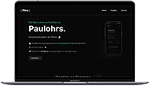

# Meu Portfólio Paulohrs 👨‍💻👨‍🔧💚
 Foi desenvolvido para atrair clientes interessados em criar seus próprios sites, me contratando para o trabalho, adicionei algumas animações que fez total diferença. 

 

vou deixar só print abaixo e não gif, para você mesmo conferir as animações do site: https://paulohrs01.github.io/Portfolio-Paulohrs/
## Demonstração da seção home em desktop:

 

## Mobile:

 

## Tecnologias utilizadas:
- HTML
- CSS
- JS

(Botão menu hamburguer com animação)
